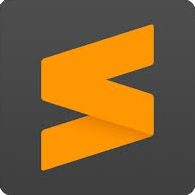
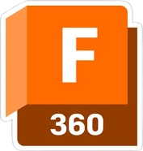
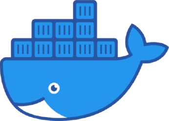
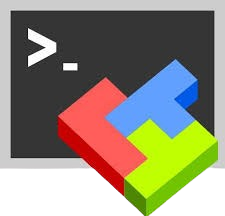
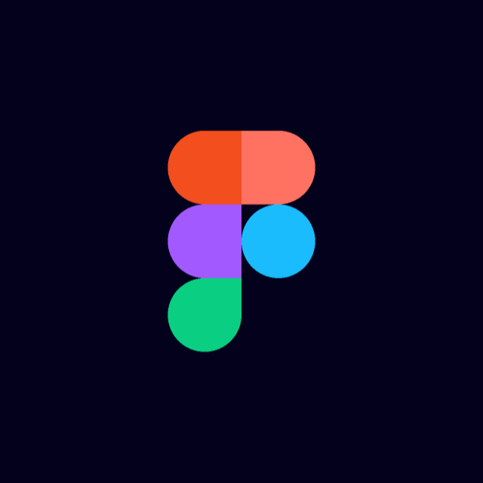

### 
👾 Presentation 👾

I am a 21-year-old French student at the [CESI engineering school](https://cesi.fr) passionate about IT and engineering.
I
am currently in my 3rd year of a 5-year-long apprenticeship in IT engineering. I am also a self-taught developer and
I have been coding for 6 years now in various languages in various technologies because I love to discover new things
and be able to adapt to any situation.

Most my biggest projects are private because they are either personal code or customer orders so don't
be surprised to see me active in commits but with not so many public repositories.

I'm looking for a **6-month international internship** in the objective of enhancing my english skills and completing my
engineering degree. I search manly in these fields, but I'm open to any other proposal:

- Embedded systems (Low-level programming)
- AI/ML/Data Science
- Software engineering

If you want to contact or work with me, go through one of the social media that you will find on
my [website](https://diskmth.fr) or [email me](mailto:diskmth@outlook.fr) to obtain my LinkedIn / resume. \
PS: My website is in rework, so it may not be up to date.

Thanks for your visit and have a good development!

-----

### 
💻 Softwares I use 💻

 

| Logo                                                                                                          | Name                     | Usage                                 |
|---------------------------------------------------------------------------------------------------------------|--------------------------|---------------------------------------|
|            | Jetbrains tools suite ❤️ | Development in various languages      |
|                | Github Copilot ❤️        | Development speed assistance          |
|  | Android studio           | Flutter/Android development           |
|      | Sublime Text             | Advanced file editing (json, yml ...) |
|         | Fusion 360               | 3D modeling                           |
|                                | Docker                   | Flawless deployment                   |
|                 | MobaXterm                | SSH/SFTP access                       |
|                           | Figma                    | Mock UI/UX design                     |

-----

### 
📊 My statistics 📊

 

   

-----

### 
👀 Visitors 👀

 

   

