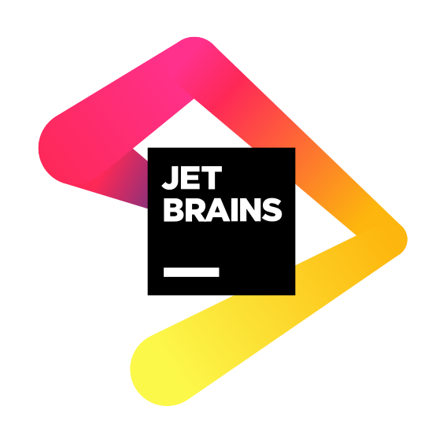
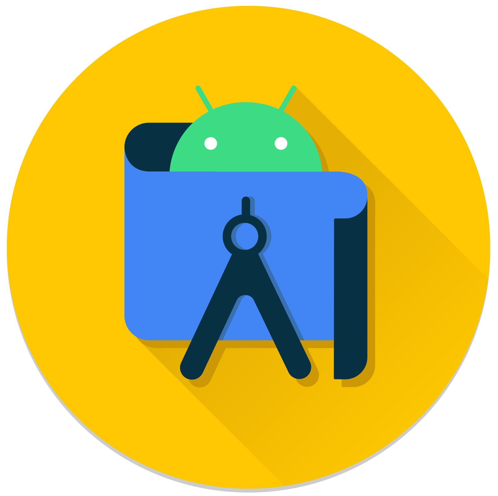

### 
👾 Presentation 👾

I am a 20 year old french student at the [CESI engineering school](https://cesi.fr) passionate by IT and new
technologies

All my biggest projects are private because they are either personal code or (for the most part) customer orders. Don't
be surprised to see me active in commits, but not to see the associated projects

If you want to contact me or work with me, go through one of the social media that you will find on
my [website](https://diskmth.fr) (new version is on developpment, data can be outdated)

I'm also looking for a 14 weeks long internship between January 13th and April 18th. For any further information, check
my [linkedin](https://www.linkedin.com/in/mathieu-gillet-17a642295)

-----

### 
💻 The software I use 💻

 

| Logo                                                                                                                                          | Name                     | Usage                                               |
|-----------------------------------------------------------------------------------------------------------------------------------------------|--------------------------|-----------------------------------------------------|
|                                                                               | Jetbrains tools suite ❤️ | Development in various languages                    |
|                                                                         | Android studio           | Flutter/Android development                         |
|                                  | Notepad++                | Advanced file editing (json, yml ...)               |
|                              | Blockbench               | 3D models making                                    |
|  | Fusion 360               | 3D modeling                                         |
|                                               | Github Copilot ❤️        | Development assistance and advanced auto-completion |
|        | Figma                    | UI/UX design                                        |
|                                  | Docker                   | One click deploy                                    |
|                                   | MobaXterm                | SSH/SFTP acess                                      |

-----

### 
📊 My statistics 📊

   

-----

### 
👀 Visitors 👀

   

